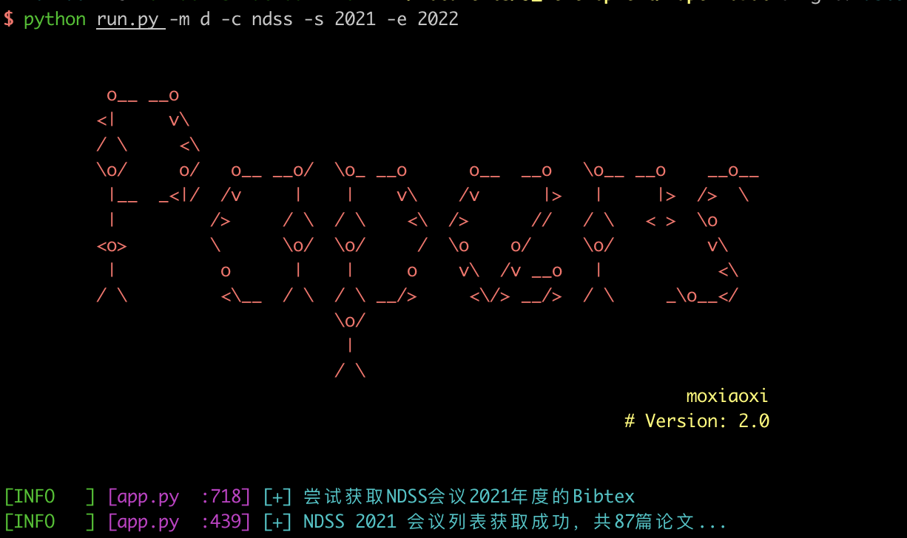

# PaperRobot

PaperRobot 是一个论文抓取工具，可以快速批量下载大量论文，方便后期进行持续的论文管理与学习。

PaperRobot通过多个接口抓取论文，目前抓取成功率维持在90%以上。通过配置Config文件，可以抓取任意计算机领域相关会议的论文。



## Installation

- Download this tool

```
git clone https://github.com/mo-xiaoxi/PaperRobot.git
```

- Install dependencies

```
sudo pip3 install -r requirements.txt
```

> *Python version: Python 3 (**>=3.7**).*


## Why build this tool?

1. 一个方便的论文调研工具： [Secpaper](https://secpaper.cn/). 论文调研必备！
2. 通过这个工具可以构建自己的论文数据库。具体参考：[如何建立独属于你自己的论文数据库](https://moxiaoxi.info/papers/2020/10/18/Papers/)
3. 提取论文的摘要，自动翻译推送整理一些会议的研究简报，可以快速地过一下每个会议论文的内容，感兴趣的再阅读对应的pdf。
4. 对会议研究热点、作者变化等等进行归类与整理。 如[Computer Science Rankings](http://csrankings.org/).


## Usage 

```bash
$ python run.py --help
usage: run.py [-h] [-m {d,s}] [-c {ccs,uss,sp,ndss,dsn,raid,imc,asiaccs,acsac,sigcomm}] [-s YEAR_START] [-e YEAR_END] [-b BIBTEX] [-t TITLE] [-u URL] [--all {bibtex,pdf}]

OPTIONS:
  -h, --help            show this help message and exit
  -m {d,s}, --mode {d,s}
                        s:show info, d: download
  -c {ccs,uss,sp,ndss,dsn,raid,imc,asiaccs,acsac,sigcomm}, --conference {ccs,uss,sp,ndss,dsn,raid,imc,asiaccs,acsac,sigcomm}
                        The target conference.
  -s YEAR_START, --year_start YEAR_START
                        The start year of paper.
  -e YEAR_END, --year_end YEAR_END
                        The end year of paper.
  -b BIBTEX, --bibtex BIBTEX
                        Download with bibtex file.
  -t TITLE, --title TITLE
                        Download with Google search.
  -u URL, --url URL     Dowanload with url.
  --all {bibtex,pdf}    Download all bibbex or papers，2001-2022 by default

```

### Example

- 基于Title下载论文
      python run.py -t "A Large-scale Analysis of Email Sender Spoofing Attacks"
- 基于URL下载论文
      python run.py -u "https://www.usenix.org/conference/usenixsecurity21/presentation/shen-kaiwen"
- 基于bib下载论文
      python run.py -b bibtex/example.bib
- 获取NDSS 2021会议论文
      python run.py -c ndss -s 2021 -e 2022
- 获取NDSS 2001-2021会议论文
      python run.py -c ndss -s 2001 -e 2022
- 获取所有会议的bibtex文件
      python run.py  --all bibtex
- 获取所有会议的pdf文件
      python run.py  --all bibtex

### 其他说明：

- PaperRobot通过dblp抓取对应会议的bibtex，以保证通用性，理论上支持任意DBLP上收录的会议。

  通过配置下列数据，可以增加新的会议支持。

  ```json
  LIB = {
      "ccs": "CCS",
      "uss": "Usenix_Security",
      "sp": "S&P",
      "ndss": "NDSS",
      "dsn": "DSN",
      "raid": "RAID",
      "imc": "IMC",
      "asiaccs": "ASIACCS",
      "acsac": "ACSAC",
      "sigcomm": "SIGCOMM",
  }
  ```

- 多个PDF辅助抓取接口：

  - 通过doi序列号在SCI-HUB抓取论文（zotera适用方法）
  - 论文官方网站抓取论文
  - 通过google搜索抓取论文
  - 通过crossRef网站抓取论文（这个接口效果不是特别好）

- keep_cookies.py 用于维护某些站点的登陆状态，需要单独运行。

  - 维护登陆状态的原因是某些网站（如dl.acm)需要登陆才能下载pdf。

    用户需要单独配置config中的账号密码，账号密码为学校账号与密码。

  - 若在教育网IP内访问, 则不需要维护Cookie信息，教育网IP直接可以下载PDF。
  - 用户也可以手动维护cookie信息，利用burpsuite等一系列工具导出cookie，写入`data/cookie.json`文件即可。


## TODO

- [ ] 更好的文档说明，中英文文档分开。
- [ ] 修改日志信息到英文版本
- [ ] 多进程+多协程并发处理
- [ ] 代理池构建
- [ ] 使用重试修饰器重写需重试的函数

